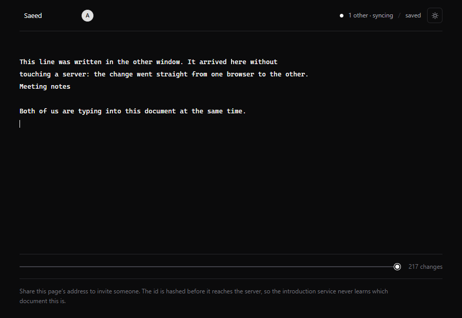

# Meridian

A shared workspace that keeps working when the internet does not.

Several people write in the same document at once. Everyone can keep typing with no
connection. When the connection comes back, all the changes merge on their own, and
every person ends up with exactly the same text.

Changes travel directly between computers over WebRTC. The server only introduces
peers to each other — it never sees what you write.



## Status

**It works, and it is fast.** All twelve weeks done: browsers edit the same
document straight through each other, survive being disconnected, step back
through everything that was typed, and it runs as a desktop application with
its own database.

- 155 tests pass, including hundreds of random convergence runs per seed.
- Two browser suites drive real Chrome windows over the whole stack.
- Everything between peers is encrypted, with the key in the link's fragment
  so the server never receives it — checked by a test that inspects the wire.
- Typecheck is clean under `strict`, from JSDoc comments — no TypeScript.
- Zero dependencies in the core. Nothing to install to run its tests.
- The sync protocol reconciles through 30% packet loss, reordering,
  duplication and network partitions — all seeded, so failures replay exactly.

At 100,000 characters a keystroke costs **5.6 ms** — inside one screen refresh.
The numbers, including the unflattering ones, are below.

## Try it

It needs **two terminals**, because both commands keep running. Running them one
after the other in a single terminal will not work: the first never finishes.

Terminal 1 — the introduction service:

```bash
npm install
npm run signal
```

Leave that running. Terminal 2 — the app:

```bash
npm run web
```

Then open <http://localhost:3000>, start a document, and paste its address into a
second browser window. Type in one and watch the other. Turn your internet off
and keep typing — it all merges when you come back.

Stop either one with **Ctrl + C**. If the signalling server says port 8080 is
already in use, an earlier run is still going: `npx kill-port 8080`.

## Checking it

```bash
npm test            # 155 tests, about four seconds
npm run typecheck
npm run two-tabs      # the whole thing, in two real browsers
npm run four-windows  # four windows, two cut off and reconnected
npm run desktop:check # the desktop app: type, reopen, read it back from SQLite
npm run bench         # how fast, at 100,000 characters
npm run packaged-check # the built application, not the source
```

Both browser suites need the app and the signalling server already running, in
their two terminals, as above.

## On the desktop

```bash
npm run desktop
```

Builds the interface and opens it as an application. Changes go to a SQLite file
in your user data directory rather than to browser storage, so it can be copied,
backed up, and survives clearing browser data.

## An installer

```bash
npm run desktop:dist
```

Produces `apps/desktop/dist/Meridian Setup 0.1.0.exe`, about 106 MB.

It is **not signed**, so Windows will warn about an unknown publisher — signing
needs a certificate. `npm run packaged-check` drives the built application
itself through a debugging port, rather than the source, and is worth running
before trusting an installer: the two are not the same thing, which is a lesson
this project learned the hard way.

## Documents

- [docs/PROPOSAL.pdf](docs/PROPOSAL.pdf) — what this is, why it is hard, and how it
  will be judged as finished.
- [docs/WORKPLAN.pdf](docs/WORKPLAN.pdf) — 12 weeks, day by day, with a "Done when"
  line for every day.
- [docs/DESIGN.pdf](docs/DESIGN.pdf) — how the merging actually works. Read this
  before changing `packages/core/src/text.js`.

The `.md` files next to them are the sources. Edit those, not the PDFs.

## Rebuilding the PDFs

```bash
bash tools/build-docs.sh            # build every document
bash tools/build-docs.sh PROPOSAL   # build just one
```

Needs Python and Chrome, both already installed on this machine. Close the PDF in
your viewer first — Windows will not let the script overwrite an open file.

## Layout

```
packages/core          the merge algorithm, plain JavaScript, no deps   BUILT
packages/storage-sql   saves to SQLite, for desktop and Node           BUILT
packages/storage-idb   saves to IndexedDB, for the browser             BUILT
packages/storage-bridge saves through the desktop app's own process   BUILT
packages/sync          the sync protocol, plus the WebRTC transport    BUILT
server/signal          introduces peers to each other                  BUILT
apps/web               the editor, in Next.js                          BUILT
apps/desktop           the desktop application, in Electron            BUILT
```

The core must never import Next.js, React or anything from the browser. That rule is
what keeps it testable in plain Node.

## What the browser test checks

`npm run two-tabs` drives two real browsers, in separate profiles so they are
genuinely two devices:

1. the two find each other through the signalling server
2. typing in one appears in the other
3. both type at once, and both edits survive
4. one goes offline, both keep editing, and they agree again on reconnect
5. the text is still there after a reload

`npm run four-windows` goes further: four windows, two of them cut off, all four
typing, then everyone back together. Four rather than two on purpose — two peers
can agree by luck, because with one connection there is only one order things
can arrive in.

These are the only tests that exercise WebRTC, because `RTCPeerConnection` does
not exist in Node.

One known flaw, printed by that test rather than hidden: when several windows
type into the *same spot* at the *same instant*, words often come out
interleaved — in that extreme case, all four survive whole in only about a third
of runs. Everyone still agrees and nothing is ever lost — both are required
by the test. The merge algorithm is not the cause; it handles the same scenario
perfectly in Node. It is a timing race between the text box and the document,
and it is written up in the design notes.

## Speed

At 100,000 characters, on an ordinary laptop:

| | median | worst |
|---|---|---|
| Type a character at the end | 0.003 ms | 0.1 ms |
| Type a character in the middle | 0.81 ms | 2.8 ms |
| **A keystroke, all the way through** | **5.6 ms** | 17.8 ms |
| Work out where the cursor is | 0.001 ms | 0.2 ms |
| Load a saved document | 536 ms | — |

"All the way through" is what the editor really does: take the new text, work
out what changed, apply it, render the result. The render is counted on
purpose — leaving it out moves the cost to the next keystroke rather than
removing it.

The first version rebuilt the whole reading order on every change: 528 µs per
character, growing with the document. Holding the letters as a chain and
remembering the last position looked up brought that to 3 µs — about 170 times
faster — and took a keystroke at the end from 1.3 ms to 0.003 ms.

What is left is honest: the 5.6 ms is almost entirely rendering the document to
a string, which is O(n) and needs a rope to improve. Loading a long document
takes half a second. Saved with full history it is 124 bytes per character,
which compacting cuts by two thirds.

`npm run bench` produces all of it.

## The one thing that matters

Week 4 of the plan ends with a test that makes thousands of random edits, applies
them in every order, and checks that every copy of the document ends up identical.

**That test passes.** The hard part is solved; what follows is ordinary work.

It has also been checked for teeth, and rechecked after the algorithm was
rewritten for speed. Stopping a letter from walking past its rivals when it is
placed — the exact mistake the ordering rule exists to prevent — fails 21
tests. A suite that cannot fail proves nothing, so it is worth repeating that
experiment after any change to `packages/core/src/text.js`.
